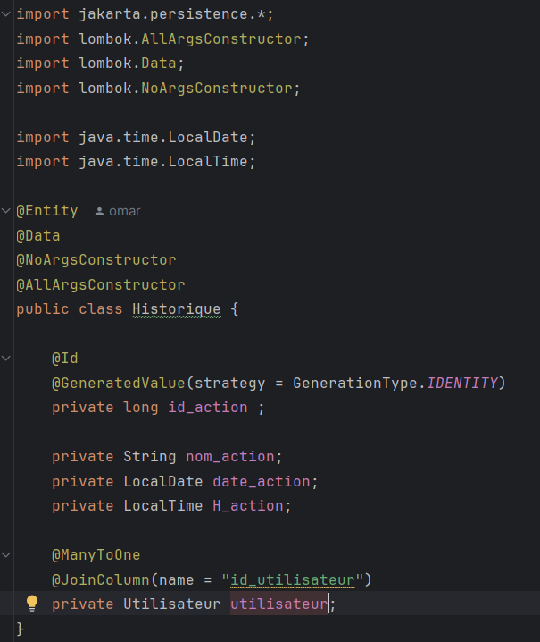

<h2>Entity User</h2>

<h2>Entity Réservation</h2>

<h2>Entity Salle</h2>

<h2>Entity Equipement</h2>

<h2>Entity Role</h2>

<h2>Entity Historique</h2>

<h2>Salle-Equip-ID</h2>

Cette entité sert simplement a créer des clés 
primaires pour la classe suivante elle ne sera pas 
créer dans la base de donnée comme entité propre

<h2>Entity SalleEquipement</h2>

